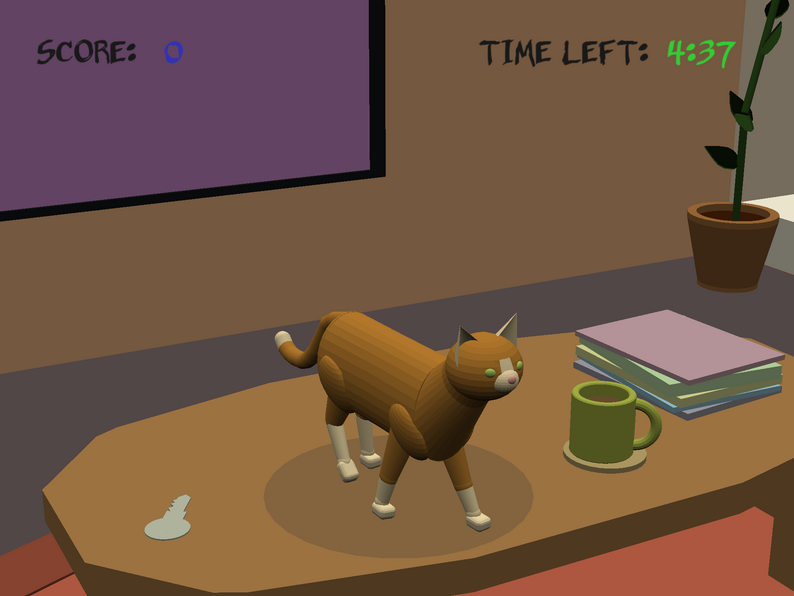

# Crime Cat

Author: Emma Liu (emmaliu), Aria Zhang (arzhang), Anna Li (ayli1), Nolan Mass (nmass)

Design: You are a mischievous orange cat with a lust for crime. Your owner is away from home for a bit, giving you a window of opportunity to wreak as much havoc in the house as possible.

Screen Shot:

How To Play:

Walk using the WASD keys.
Click to swat/pick up/drop items.
Click/ESC to make the camera (un)follow the mouse.
Move the mouse to rotate the camera.

Sources:

We used music from the following sources:
- ["Blippy Trance"](https://freepd.com/misc.php)
- [Ceramic Shattering Sound](https://freesound.org/people/m_delaparra/sounds/338018/)
- [Tearing Sound](https://freesound.org/people/InspectorJ/sounds/415765/)
- [Papers Sound](https://freesound.org/people/XTYL33/sounds/68223/)
- [Clinking Sound](https://freesound.org/people/RoyalRose/sounds/560298/)
- [Clicking Sound](https://freesound.org/people/budek/sounds/513481/)
- [Pillow Sound](https://freesound.org/people/ChristiaanAckermann21100333/sounds/593726/)
- [Door Sound](https://freesound.org/people/LG/sounds/73046/)
- [Trophy/Lamp Sound](https://freesound.org/people/nicholasdaryl/sounds/563457/)
- [Typing Sound](https://freesound.org/people/Debsound/sounds/168822/)
- [Splash Sound](https://freesound.org/people/soundscalpel.com/sounds/110393/)
- [Meow Sound](https://freesound.org/people/Mafon2/sounds/436541/)

We referenced the following code to render images as 2D textures:
- https://github.com/kjannakh/15-466-f20-base4/blob/master/PlayMode.cpp

We obtained the following free fonts from FontSquirrel:
- [Belligerent Madness](https://www.fontsquirrel.com/fonts/belligerent-madness)
- [Nunito](https://www.fontsquirrel.com/fonts/nunito?q%5Bterm%5D=nunito&q%5Bsearch_check%5D=Y)

We referenced the following code to render images as 2D textures:
- https://github.com/kjannakh/15-466-f20-base4/blob/master/PlayMode.cpp

All 3D assets and title screen drawing created by Anna Li.

This game was built with [NEST](NEST.md).

